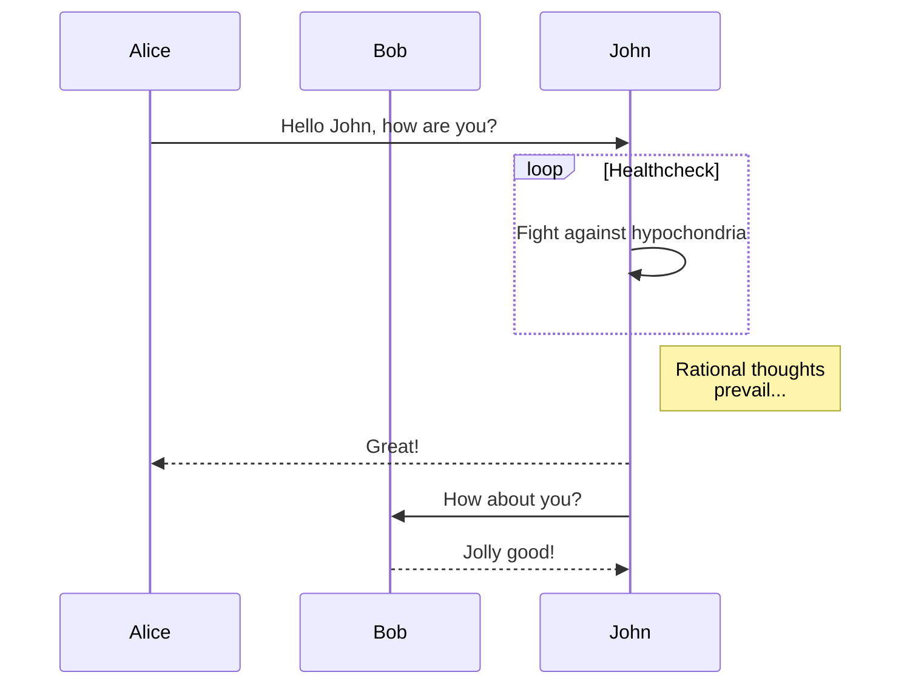
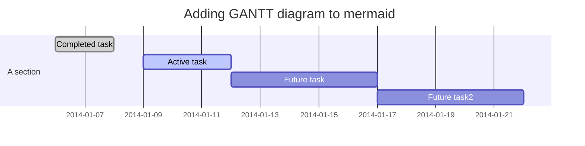
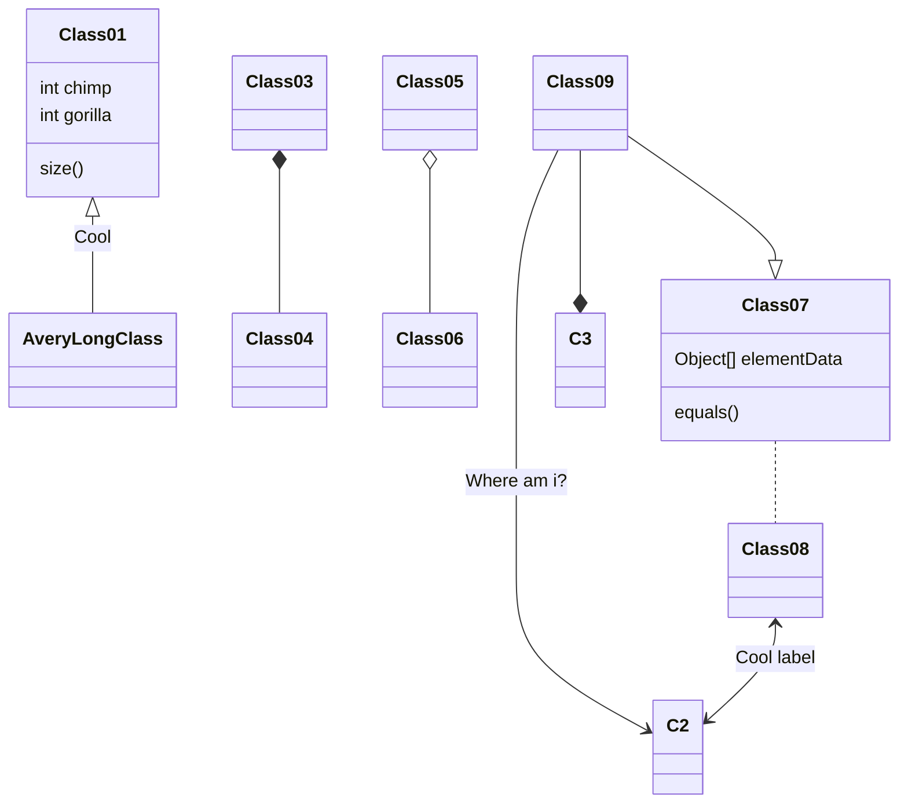

>欢迎体验 [Fluid](https://github.com/fluid-dev/hexo-theme-fluid) ，这是一款 Material Design 风格的 Hexo 主题，以简约的设计帮助你专注于写作，本篇文章可预览主题的样式及功能。

<!-- more -->

## 文字

文章大部分使用的是 github-markdown 样式，并加入了一些 Material 风格。

### H3 标题

#### H4 标题

**粗体**

_斜体_

## 代码

行内代码：`$ hexo new post "My New Post"`

代码高亮使用的是 highlight.js，支持 185 种语言和 91 种高亮样式：

```python
def fib(n):
    a, b = 0, 1
    while a < n:
        print(a, end=' ')
        a, b = b, a+b
    print()
fib(1000)
```

```go
type Map struct {
    mu Mutex
    read atomic.Value
    dirty map[interface{}]*entry
    misses int
}
```

## 表格

| Header 1 | Header 2 | Header 3 |
| --- | --- | --- |
| Key 1 | Value 1 | Comment 1 |
| Key 2 | Value 2 | Comment 2 |
| Key 3 | Value 3 | Comment 3 |

## 列表

### 有序列表

Fluid 相较于其他主题的优势：

1. 设计遵循简洁至上，同时具有轻快的体验，和优雅的颜值；
2. 提供大量定制化配置项，使每个用户使用该主题都能具有独特的样式；
3. 响应式页面，适配手机、平板等设备；

### 无序列表

Fluid 功能特性：

- 图片懒加载
- 自定义代码高亮方案
- 内置多语言
- 支持多款评论插件
- 支持使用数据文件存放配置
- 自定义静态资源 CDN
- 内置文章搜索
- 页脚备案信息
- 网页访问统计
- 支持 LaTeX 数学公式
- 支持 mermaid 流程图
- 音乐播放器

## 图片


## LaTex

基于 MathJax 引擎：

$$
\Gamma _ { \epsilon } ( x ) = [ 1- e ^ { - 2\pi \epsilon } ] ^ { 1- x } \prod _ { n = 0} ^ { \infty } \frac { 1- \operatorname{exp} ( - 2\pi \epsilon ( n + 1) ) } { 1- \operatorname{exp} ( - 2\pi \epsilon ( x + n ) ) }
$$

$$
\left( \begin{array} c t ^ { \prime } \\ x ^ { \prime } \\ y ^ { \prime } \\ z ^ { \prime } \end{array} \right) = \left( \begin{array} { c c c c } { \gamma } & { - \gamma \beta } & { 0 } & { 0 } \\ { - \gamma \beta } & { \gamma } & { 0 } & { 0 } \\ { 0 } & { 0 } & { 1 } & { 0 } \\ { 0 } & { 0 } & { 0 } & { 1 } \end{array} \right) \left( \begin{array} c t \\ x \\ y \\ z \end{array} \right)
$$

$$
6 \mathrm { CO } _ { 2 } + 6 \mathrm { H } _ { 2 } \mathrm { O } \rightarrow \mathrm { C } _ { 6 } \mathrm { H } _ { 12 } \mathrm { O } _ { 6 } + 6 \mathrm { O } _ { 2 }
$$

## 流程图

基于 mermaid 语法：







## 内置 Tag 插件

内置了一些 Tag 插件，用于实现 Markdown 不容易生成的样式，具体使用方式请见 [用户指南](https://hexo.fluid-dev.com/docs/guide/#tag-%E6%8F%92%E4%BB%B6)。

### 便签


这里可以写文字 或者 `markdown`



这里可以写文字 或者 `markdown`



这里可以写文字 或者 `markdown`


### 行内标签

  

### 勾选框



### 按钮



### 组图


  
  
  
  
  


### 脚注

以下是脚注演示[^1]：

如果你有 Fluid 主题或 Hexo 博客相关的文章，可以通过 Pull Request 方式投稿[^2]。

[^1]: 脚注演示
[^2]: 投稿具体详见[https://github.com/fluid-dev/hexo-fluid-blog](https://github.com/fluid-dev/hexo-fluid-blog)
